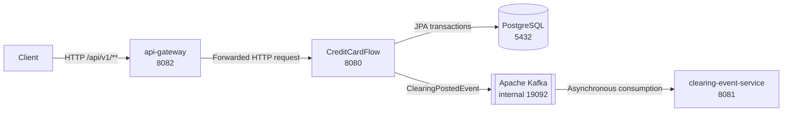

# CreditCardFlow System Architecture

## Purpose

CreditCardFlow is a synthetic educational backend that models a subset of issuer-side credit-card processing. It provides secured REST operations for merchants, card accounts, cards, authorizations, reversals, and clearings, together with asynchronous notification of posted clearings. It is not intended to handle real cardholder data or represent a complete production payment platform.

## Logical Architecture

The Gateway-to-CreditCardFlow path is synchronous HTTP. The clearing event service is not called synchronously by CreditCardFlow or routed through the Gateway; it receives events asynchronously from Kafka.

## Component Responsibilities

### API Gateway

`api-gateway` is an independent Spring Boot and Spring Cloud Gateway application.

- Acts as the external REST entry point for the containerized architecture.
- Routes `/api/v1/**` to CreditCardFlow without stripping or rewriting the path.
- Preserves the `Authorization` header and downstream response.
- Does not authenticate credentials, parse JWTs, or implement authorization rules.
- Exposes its own Actuator health and information endpoints.

### CreditCardFlow

The root CreditCardFlow application owns the business and security boundary.

- Exposes the Merchant, CardAccount, Card, Authorization, Reversal, Clearing, and authentication REST APIs.
- Uses Spring Security for persistent-user authentication, stateless JWT validation, and USER/ADMIN authorization.
- Applies validation, centralized exception handling, and transactional business rules.
- Persists domain state through Spring Data JPA and PostgreSQL.
- Publishes `ClearingPostedEvent` messages after successful clearing transaction commits.
- Exposes Actuator health, information, and metrics endpoints.

The root Kafka consumer is disabled during normal runtime. It is retained for the focused embedded producer-to-consumer integration test.

### PostgreSQL

PostgreSQL provides transactional persistence for the root application.

- Stores domain entities and persistent application users.
- Enforces primary keys, foreign keys, business-reference uniqueness, nullability, and status checks.
- Stores fixed-precision financial values.
- Uses a Flyway-owned schema; Hibernate validates rather than creates or updates that schema.

### Kafka

Apache Kafka transports posted-clearing events asynchronously.

- Topic: `creditcardflow.transaction-events`
- Compose internal client listener: `kafka:19092`
- Compose host listener: `localhost:9092`
- Kubernetes client Service: `kafka:19092`
- Current topic design: one partition and one replica

Kafka is not used as the transactional database, and the implementation does not claim an outbox or exactly-once delivery guarantee.

### Clearing Event Service

`clearing-event-service` is an independently packaged Spring Boot application.

- Consumes `creditcardflow.transaction-events` as consumer group `clearing-event-service`.
- Deserializes headerless JSON into its own local `ClearingPostedEvent` type.
- Logs only the event ID, clearing reference, and status.
- Has no database and does not call CreditCardFlow over REST.
- Exposes its own Actuator health and information endpoints.

## Runtime and Deployment Architecture

### Docker

The repository contains separate multi-stage Dockerfiles for:

- `creditcardflow`
- `clearing-event-service`
- `api-gateway`

Each runtime image contains the executable application JAR and Java runtime requirements, runs as a non-root user, and exposes its application port.

### Docker Compose

The root `compose.yaml` runs five services on the default Compose network:

| Service | Responsibility | Host port |
|---|---|---:|
| `postgres` | PostgreSQL persistence | 5432 |
| `kafka` | Single-node KRaft broker/controller | 9092 |
| `creditcardflow` | Root business and security service | 8080 |
| `clearing-event-service` | Kafka event consumer | 8081 |
| `api-gateway` | External REST entry point | 8082 |

Within the Compose network, CreditCardFlow reaches PostgreSQL at `postgres:5432`; both Kafka clients reach Kafka at `kafka:19092`; and the Gateway reaches CreditCardFlow at `creditcardflow:8080`. Infrastructure health checks gate dependent startup without sleep commands.

### Kubernetes

Plain manifests under `k8s/` define the same logical components in namespace `creditcardflow`.

- PostgreSQL uses a PersistentVolumeClaim and an internal ClusterIP Service.
- Kafka, CreditCardFlow, and clearing-event-service use internal ClusterIP Services.
- API Gateway is the only externally exposed application, through NodePort `30082` targeting port 8082.
- The three Java applications use startup, readiness, and liveness probes against `/actuator/health`.
- Runtime configuration is separated between a ConfigMap and an example Secret boundary.

The manifests were statically/offline validated and were not deployed to a live Kubernetes cluster as part of this implementation.

## Observability

- CreditCardFlow exposes Actuator health, information, and metrics endpoints.
- Micrometer records authorization-approved, authorization-declined, reversal-completed, and clearing-posted counters.
- A service-layer AOP aspect logs method outcome and duration without intentionally logging argument or DTO values.
- The Gateway and clearing event service expose their own health and information endpoints.

## CI Architecture

GitHub Actions runs three independent Maven test jobs for CreditCardFlow, clearing-event-service, and api-gateway. A downstream Docker job runs only after all three test jobs pass; it validates the Compose configuration and builds all three application images.

The workflow implements continuous integration and build verification. It does not publish images or deploy Kubernetes resources.
