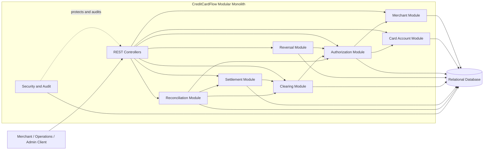
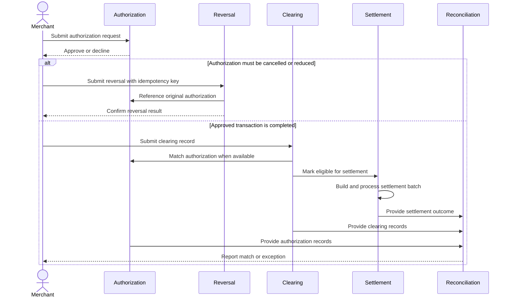

# CreditCardFlow Architecture

## Architectural approach

CreditCardFlow begins as a **modular monolith**: one Spring Boot application and deployment unit with explicit business-module boundaries. This approach keeps the capstone operationally simple while allowing each domain area to develop with limited coupling and a clear path to later extraction.

Modules should communicate through defined service interfaces and domain-level contracts rather than reaching into another module's persistence implementation. Cross-module database relationships should be used deliberately so future service boundaries remain practical.

## Layered structure

The synchronous request path follows this dependency direction:

`controller -> service -> repository -> database`

- **Controller**: Defines HTTP endpoints, authenticates and authorizes requests, validates transport-level input, and maps results to API responses.
- **Service**: Owns use-case orchestration, transaction boundaries, domain rules, idempotency, and coordination between modules.
- **Repository**: Encapsulates persistence operations and queries.
- **Database**: Stores application state, immutable financial records, audit information, and processing metadata.

Dependencies flow inward through these layers. Controllers do not access repositories directly, and repositories do not contain workflow logic.

## DTO and entity separation

API DTOs are separate from JPA entities. Request and response DTOs define the external contract and its validation, while JPA entities represent persistence concerns. Mapping occurs at the application boundary or in dedicated mappers.

This separation prevents database structure from becoming the API contract, avoids accidental serialization of internal or sensitive fields, and permits either side to evolve independently.

## Planned package structure

The following is a plan, not a requirement to create these packages during the documentation phase:

```text
com.hx.creditcardflow
|-- common
|   |-- error
|   |-- idempotency
|   `-- audit
|-- merchant
|   |-- controller
|   |-- service
|   |-- repository
|   |-- dto
|   `-- entity
|-- cardaccount
|   |-- controller
|   |-- service
|   |-- repository
|   |-- dto
|   `-- entity
|-- authorization
|   |-- controller
|   |-- service
|   |-- repository
|   |-- dto
|   `-- entity
|-- reversal
|   |-- controller
|   |-- service
|   |-- repository
|   |-- dto
|   `-- entity
|-- clearing
|   |-- controller
|   |-- service
|   |-- repository
|   |-- dto
|   `-- entity
|-- settlement
|   |-- controller
|   |-- service
|   |-- repository
|   |-- dto
|   `-- entity
|-- reconciliation
|   |-- controller
|   |-- service
|   |-- repository
|   |-- dto
|   `-- entity
|-- security
|-- messaging
`-- configuration
```

Packaging by business capability keeps related layers together and makes module ownership clearer than a single application-wide package for each technical layer.

## Planned domain objects

- **Merchant**: Represents an onboarded merchant, its identifier, status, and operational attributes.
- **CardAccount**: Represents a simplified issuer account with a synthetic card reference, account status, credit limit, and available credit.
- **AuthorizationTransaction**: Records an authorization request, decision, amount, merchant, account reference, idempotency information, and lifecycle status.
- **ReversalTransaction**: Records the cancellation or reduction of a prior authorization and references the transaction being reversed.
- **ClearingRecord**: Represents a merchant-presented financial record to be matched with earlier authorization activity.
- **SettlementBatch**: Groups eligible clearing records, totals the issuer's settlement position, and tracks batch processing state.
- **ReconciliationResult**: Records the outcome of comparing transaction stages, including matches and classified exceptions.

## Financial record immutability

Financial transactions are immutable business records. Once accepted, their original monetary facts and decision history must not be overwritten or deleted as a routine correction mechanism. Corrections are represented by linked **reversal**, **refund**, or **adjustment** records, preserving both the original event and the compensating action.

Mutable processing metadata, such as a workflow status, may change only through controlled state transitions with appropriate auditing and concurrency protection. Monetary amounts should use fixed-precision decimal types and explicit currency semantics.

## Component diagram



## High-level transaction flow



## Future evolution

The modular monolith remains the initial target. As volume, team ownership, or independent scaling needs grow, durable domain events can be published through an outbox pattern to Kafka. Candidate events include authorization decided, authorization reversed, clearing received, settlement completed, and reconciliation exception detected.

Kafka-based processing can decouple clearing, settlement, reconciliation, notification, and monitoring workflows. Mature modules may then be extracted incrementally into microservices, each owning its data and APIs. This evolution requires explicit event schemas, idempotent consumers, partitioning and ordering rules, retry and dead-letter strategies, distributed tracing, and reconciliation for eventual consistency. Microservices and Kafka are planned evolution points, not MVP prerequisites.
