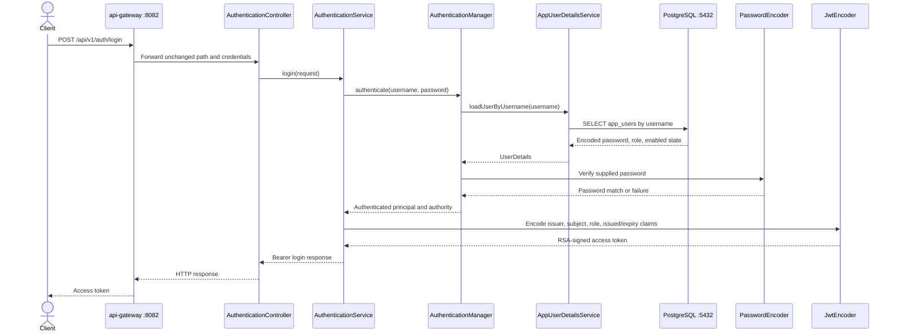
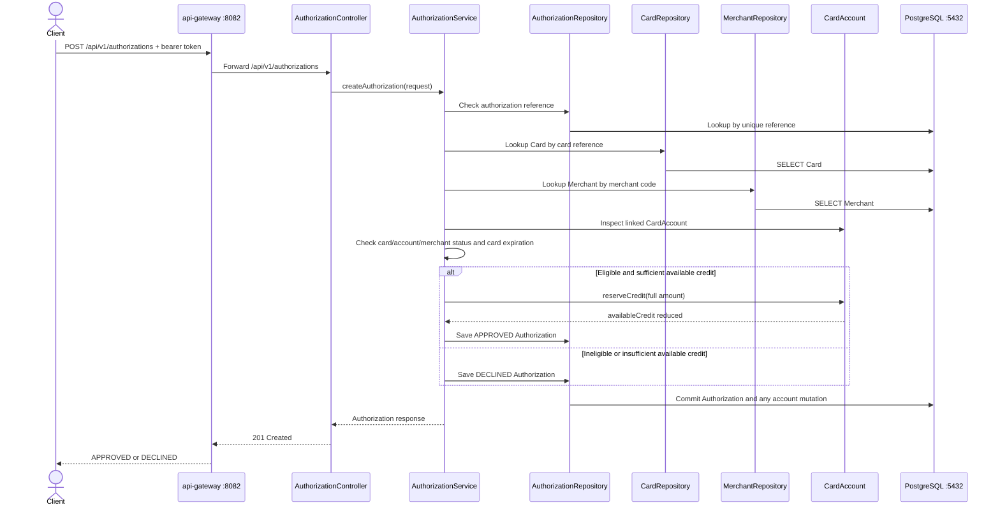
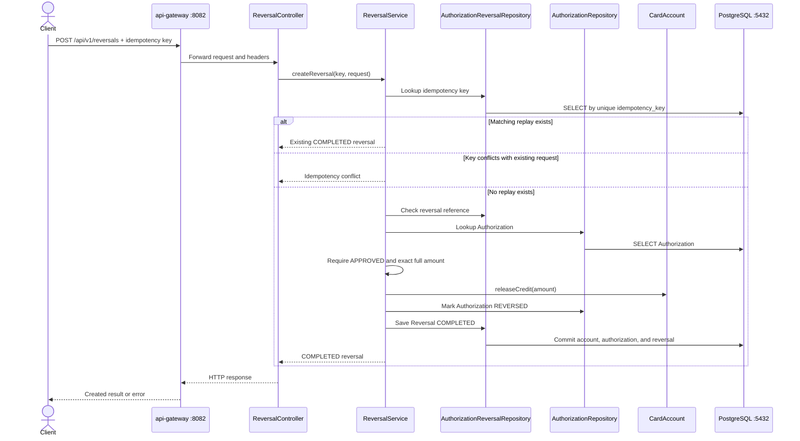
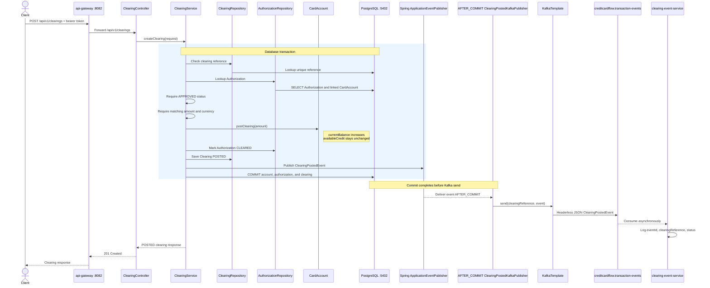
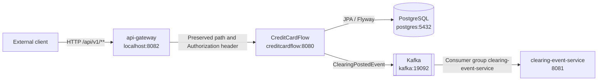

# CreditCardFlow Data Flows

## Authentication Flow

The Gateway does not authenticate the credentials or validate the resulting JWT. CreditCardFlow owns authentication and security. Later API requests send `Authorization: Bearer <token>` through the Gateway unchanged; CreditCardFlow's OAuth2 Resource Server validates the signature, standard claims, and issuer, then maps the `role` claim to a USER or ADMIN authority.

The in-memory RSA key pair is generated at application startup, and issued access tokens have a 30-minute lifetime. Restarting CreditCardFlow invalidates previously issued tokens.

## Authorization Flow

Bean Validation checks the request shape, positive two-decimal amount, and currency-code format. Authorization eligibility checks card, card-account, and merchant state plus expiration. The service does not implement partial approvals: it reserves the complete requested amount or declines the authorization.

Financial effect:

| State | `availableCredit` | `currentBalance` |
|---|---|---|
| Before request | Existing value | Existing value |
| Approved | Decreased by full authorization amount | Unchanged |
| Declined | Unchanged | Unchanged |

## Reversal Flow

Only an `APPROVED` authorization can be reversed, and the reversal amount must be numerically equal to the full authorization amount. A successful reversal increases `availableCredit` by that amount and leaves `currentBalance` unchanged. The authorization, account mutation, and reversal are committed in one transaction.

Application replay checks are backed by unique database constraints on `idempotency_key` and `reversal_reference`. Replaying the same logical request does not release credit or create another reversal.

## Clearing Flow

Clearing converts pending exposure into posted balance:

- `currentBalance` increases by the clearing amount.
- `availableCredit` remains unchanged because the authorization already reserved it.
- Authorization changes from `APPROVED` to `CLEARED`.
- Clearing is persisted as `POSTED`.

The account, authorization, and clearing changes share one database transaction. The Spring event is raised inside that transaction, but the Kafka publisher listens with `@TransactionalEventListener(AFTER_COMMIT)`. A database rollback therefore prevents the Kafka send.

After commit, immediate or asynchronous Kafka send failures are logged and contained. They do not roll back the committed clearing. The implementation does not provide a transactional outbox or exactly-once delivery guarantee.

## Containerized Runtime Flow

Container verification established:

- All five Compose services started successfully.
- CreditCardFlow, clearing-event-service, and api-gateway health endpoints returned `UP`.
- An intentional failed login traversed Gateway → CreditCardFlow → persisted-user lookup in PostgreSQL and returned the expected 401.
- Flyway migrations V1-V10 executed in PostgreSQL.
- The Kafka topic existed with one partition and replication factor one.
- A representative headerless JSON event sent through Kafka was consumed and logged by the real clearing-event-service container.

The intentional 401 verified connectivity and security behavior; no default application user was seeded.
