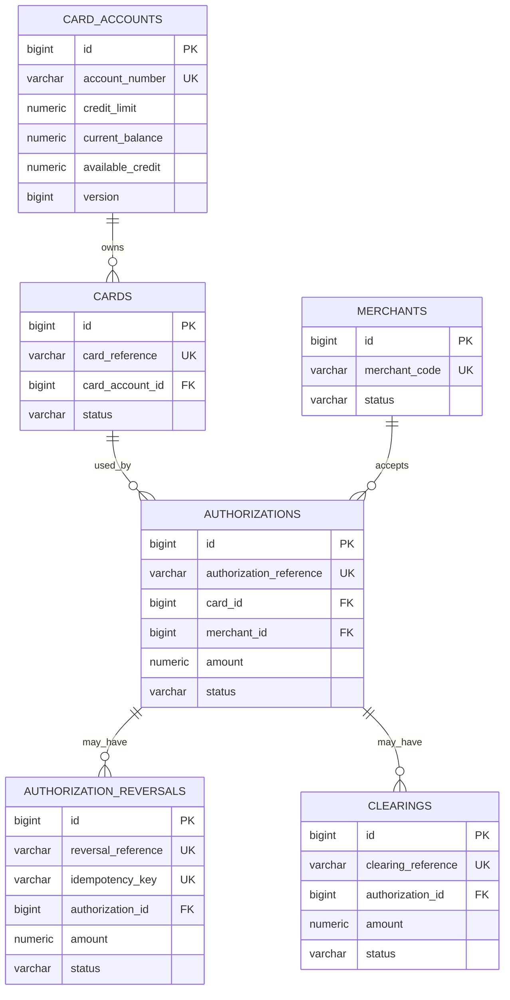

# CreditCardFlow Database Design

## Database Strategy

CreditCardFlow uses PostgreSQL 18.4 for transactional persistence and Spring Data JPA for repository access. Flyway owns schema creation and forward evolution through migrations V1-V10. With the local PostgreSQL profile, Hibernate uses `ddl-auto=validate`, ensuring that entity mappings agree with the migrated schema without allowing Hibernate to create or alter it.

The clearing event service and API Gateway do not have databases.

## Entity and Table Inventory

| Java entity | Table | Purpose |
|---|---|---|
| `Merchant` | `merchants` | Merchant identity, classification, country, and lifecycle state |
| `CardAccount` | `card_accounts` | Credit limit, balances, available credit, currency, status, and optimistic-lock version |
| `Card` | `cards` | Synthetic card reference, masked identifier, expiration, status, and owning account |
| `Authorization` | `authorizations` | Approval/decline decision, amount, currency, channel, type, card, and merchant |
| `AuthorizationReversal` | `authorization_reversals` | Completed reversal and replay identity for an authorization |
| `Clearing` | `clearings` | Posted clearing linked to an authorization |
| `AppUser` | `app_users` | Persistent encoded credentials, role, and enabled state |

No settlement or reconciliation tables exist.

## ER Diagram

Every child FK shown is non-null. The schema does not place a unique constraint on `authorization_reversals.authorization_id` or `clearings.authorization_id`; therefore, the ER diagram conservatively represents zero-to-many database cardinality. Current service status rules prevent repeated successful reversal or clearing of the same authorization.

`app_users` is independent of the transaction entity graph.

## Table Summaries

### `merchants`

- Purpose: identifies a merchant involved in authorization decisions.
- Primary key: identity `id`.
- Business reference: `merchant_code`, unique and non-null.
- Major fields: legal/display names, merchant category code, country code, and status.
- Integrity: status check allows `ACTIVE`, `SUSPENDED`, and `CLOSED`.

### `card_accounts`

- Purpose: owns the credit line and financial exposure state.
- Primary key: identity `id`.
- Business reference: `account_number`, unique and non-null.
- Major fields: `credit_limit`, `current_balance`, `available_credit`, currency code, status, and `version`.
- Integrity: status check allows `ACTIVE`, `SUSPENDED`, `DELINQUENT`, and `CLOSED`; version is non-null.

### `cards`

- Purpose: represents a synthetic card issued against a card account.
- Primary key: identity `id`.
- Business reference: `card_reference`, unique and non-null.
- Major fields: last four digits, expiration month/year, and status.
- Foreign key: non-null `card_account_id` references `card_accounts.id`.
- Integrity: status check allows `ACTIVE`, `BLOCKED`, `EXPIRED`, `REPLACED`, and `CLOSED`.

### `authorizations`

- Purpose: records an authorization request and its approval or decline outcome.
- Primary key: identity `id`.
- Business reference: `authorization_reference`, unique and non-null.
- Major fields: amount, currency code, authorization type, channel, and status.
- Foreign keys: non-null `card_id` references `cards.id`; non-null `merchant_id` references `merchants.id`.
- Integrity: checks constrain authorization type, channel, and the statuses `PENDING`, `APPROVED`, `DECLINED`, `REVERSED`, and `CLEARED`.

### `authorization_reversals`

- Purpose: records a completed full reversal and its replay identity.
- Primary key: identity `id`.
- Business references: `reversal_reference` and `idempotency_key`, both unique and non-null.
- Major fields: amount and status.
- Foreign key: non-null `authorization_id` references `authorizations.id`.
- Integrity: status check allows `PENDING` and `COMPLETED`.

### `clearings`

- Purpose: records posting of a previously approved authorization.
- Primary key: identity `id`.
- Business reference: `clearing_reference`, unique and non-null.
- Major fields: amount, currency code, and status.
- Foreign key: non-null `authorization_id` references `authorizations.id`.
- Integrity: status check allows `PENDING` and `POSTED`.

### `app_users`

- Purpose: supplies persistent identities to Spring Security.
- Primary key: identity `id`.
- Business reference: `username`, unique and non-null.
- Major fields: encoded `password_hash`, role, and enabled flag.
- Integrity: role check allows `USER` and `ADMIN`.

## Financial Data

Financial fields use Java `BigDecimal` and PostgreSQL `NUMERIC(19,2)`:

- `card_accounts.credit_limit`
- `card_accounts.current_balance`
- `card_accounts.available_credit`
- `authorizations.amount`
- `authorization_reversals.amount`
- `clearings.amount`

Fixed-precision decimal types avoid the binary rounding behavior of floating-point representations and preserve exact currency arithmetic at the configured two-decimal scale.

## Integrity Controls

- Identity primary keys provide row identity.
- Non-null foreign keys preserve required domain relationships.
- Unique constraints protect merchant, account, card, authorization, reversal, clearing, username, and idempotency references.
- Non-null constraints protect required business and persistence values.
- Check constraints restrict persisted enum/status values.
- Transactional services apply related financial and status changes atomically.
- The database remains the final race-safe uniqueness boundary even when the application performs a duplicate precheck.

## Optimistic Locking

`CardAccount` is the only entity with JPA `@Version`. Its `version` column protects concurrent financial changes such as credit reservation, reversal release, clearing posting, and credit-limit updates. A stale update fails rather than silently overwriting a newer account state.

No version field is claimed for the other entities.

## Reversal Idempotency

Reversal processing distinguishes replay identity from ordinary duplicate prevention:

- `idempotency_key` identifies a logical request. A matching replay returns the existing reversal without releasing credit again.
- Reusing the key with different request data is rejected as an idempotency conflict.
- `reversal_reference` independently prevents duplicate reversal references.
- Unique database constraints on both columns protect against races that pass application prechecks.

This is request idempotency for reversal creation, not Kafka exactly-once processing.

## Migration Summary

| Version | Migration | Purpose |
|---:|---|---|
| V1 | `V1__create_merchants_table.sql` | Creates `merchants` and unique merchant code |
| V2 | `V2__add_merchant_status_check_constraint.sql` | Adds the merchant status check |
| V3 | `V3__create_card_accounts_table.sql` | Creates `card_accounts`, financial fields, status check, and version |
| V4 | `V4__create_cards_table.sql` | Creates `cards` and the Card-to-CardAccount FK |
| V5 | `V5__create_authorizations_table.sql` | Creates `authorizations`, its checks, and Card/Merchant FKs |
| V6 | `V6__add_reversal_support.sql` | Adds `REVERSED` authorization status and creates `authorization_reversals` |
| V7 | `V7__add_reversal_idempotency.sql` | Adds non-null unique reversal idempotency keys |
| V8 | `V8__add_clearing_support.sql` | Adds `CLEARED` authorization status and creates `clearings` |
| V9 | `V9__add_clearing_posted_status.sql` | Adds `POSTED` to the clearing status check |
| V10 | `V10__create_app_users_table.sql` | Creates persistent application users and role constraints |

Previously applied versioned migrations are treated as immutable; future schema changes require new forward migrations.
